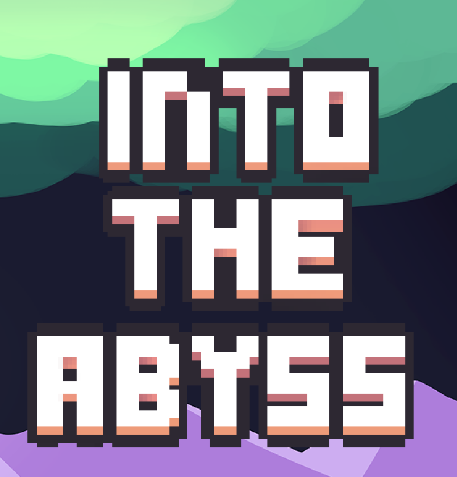
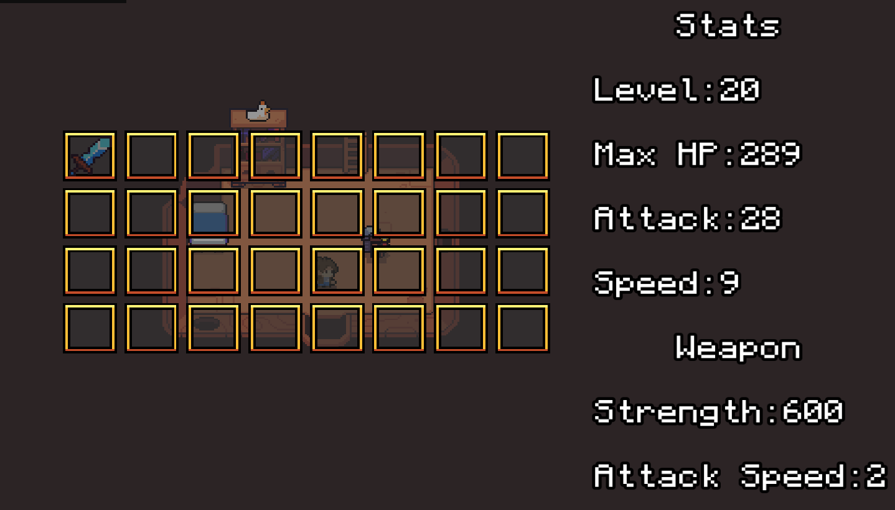
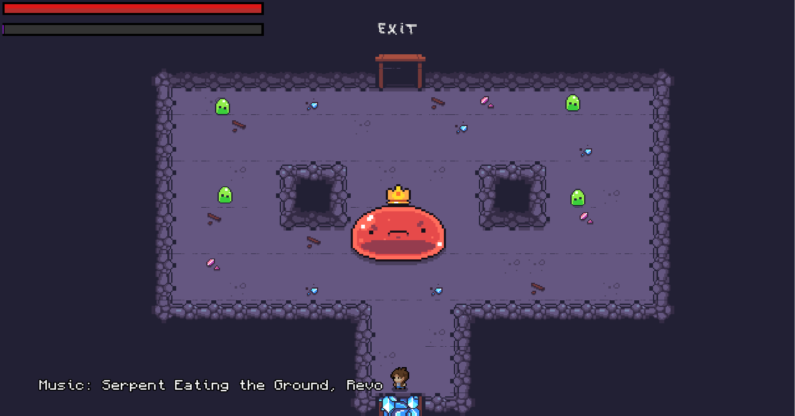

<a name="readme-top"></a>

<!-- TABLE OF CONTENTS -->
<details>
  <summary>Table of Contents</summary>
  <ol>
    <li>
      <a href="#about-the-project">About The Project</a>
      <ul>
        <li><a href="#built-with">Built With</a></li>
      </ul>
    </li>
    <li>
      <a href="#getting-started">Getting Started</a>
      <ul>
        <li><a href="#prerequisites">Prerequisites</a></li>
        <li><a href="#installation">Installation</a></li>
      </ul>
    </li>
    <li><a href="#usage">Usage</a></li>
    <li><a href="#roadmap">Roadmap</a></li>
  </ol>
</details>


<!-- ABOUT THE PROJECT -->
## About The Project

</img>
</img>
</img>
</img>

# RPG
- **Contributors:**
  - [Léo Wehrle - Rentmeister](https://github.com/leoWherle)
  - [Théodore Magna](https://github.com/TheodoreEpitech)
  - [Martin Sabatier](https://github.com/Nevi1)
  - [Nathanael Kimbembe-Croissant](https://github.com/Nathanael-Kimbembe)
<p align="right">(<a href="#readme-top">back to top</a>)</p>


### Built With

[![C][C]][C-url]

[![CSFML][CSFML]][CSFML-url]

<p align="right">(<a href="#readme-top">back to top</a>)</p>


<!-- GETTING STARTED -->
## Getting Started

### Prerequisites

Install CSFML Library if you don't already have it :
[CSFML Installation](https://www.sfml-dev.org/download/csfml/)

### Installation

1. Clone the repo
   ```sh
   git clone https://github.com:LeoWherle/myrpg.git
   ```
2. Build the program
    (in the repository)
    ```
    make
    ```

<p align="right">(<a href="#readme-top">back to top</a>)</p>


<!-- USAGE -->
## Usage

  Execute the built binary file  in the repository :
  ```
    ./my_rpg
  ```

<p align="right">(<a href="#readme-top">back to top</a>)</p>


<!-- LICENSE -->
## License

Distributed under the GNU GENERAL PUBLIC LICENSE See `LICENSE.txt` for more information.

<p align="right">(<a href="#readme-top">back to top</a>)</p>


<!-- ACKNOWLEDGMENTS -->
## Acknowledgments

Art :
* [Img Shields](https://shields.io) for this readme
* [Forager](https://store.steampowered.com/app/751780/Forager/) for most of the assets

Music :
* [Pulsating Power](assets/music/Pulsating-Power.ogg) by Keichi Okabe
* [Seliana (Day)](assets/music/Seliana-Day-Theme.ogg) by Akihiko Narita
* [Octopath Traveler main theme](assets/music/Octopath-Traveler-Main-Theme.ogg) by Yasunori Nishiki
* [Serpent Eating the Ground](assets/music/Serpent-Eating-the-Ground.ogg) by Revo
* [Victory Fanfare](assets/music/Victory-Fanfare.ogg) by Nobuo Uematsu
<p align="right">(<a href="#readme-top">back to top</a>)</p>


<!-- MARKDOWN LINKS & IMAGES -->
<!-- https://www.markdownguide.org/basic-syntax/#reference-style-links -->
[contributors-shield]: https://img.shields.io/github/contributors/othneildrew/Best-README-Template.svg?style=for-the-badge
[contributors-url]: https://github.com/othneildrew/Best-README-Template/graphs/contributors
[forks-shield]: https://img.shields.io/github/forks/othneildrew/Best-README-Template.svg?style=for-the-badge
[forks-url]: https://github.com/othneildrew/Best-README-Template/network/members
[stars-shield]: https://img.shields.io/github/stars/othneildrew/Best-README-Template.svg?style=for-the-badge
[stars-url]: https://github.com/othneildrew/Best-README-Template/stargazers
[issues-shield]: https://img.shields.io/github/issues/othneildrew/Best-README-Template.svg?style=for-the-badge
[issues-url]: https://github.com/othneildrew/Best-README-Template/issues
[license-shield]: https://img.shields.io/github/license/othneildrew/Best-README-Template.svg?style=for-the-badge
[license-url]: https://github.com/othneildrew/Best-README-Template/blob/master/LICENSE.txt
[linkedin-shield]: https://img.shields.io/badge/-LinkedIn-black.svg?style=for-the-badge&logo=linkedin&colorB=555
[linkedin-url]: https://linkedin.com/in/othneildrew
[product-screenshot]: preview.png

[C]: https://img.shields.io/badge/C-00599C?style=for-the-badge&logo=c&logoColor=white
[C-url]: https://www.iso.org/standard/74528.html
[CSFML]: https://img.shields.io/badge/CSFML-8CC445?logo=SFML&logoColor=white&style=for-the-badge
[CSFML-url]: https://26.customprotocol.com/csfml/index.htm